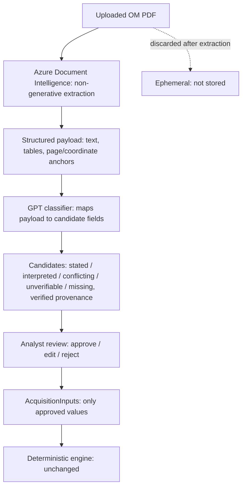
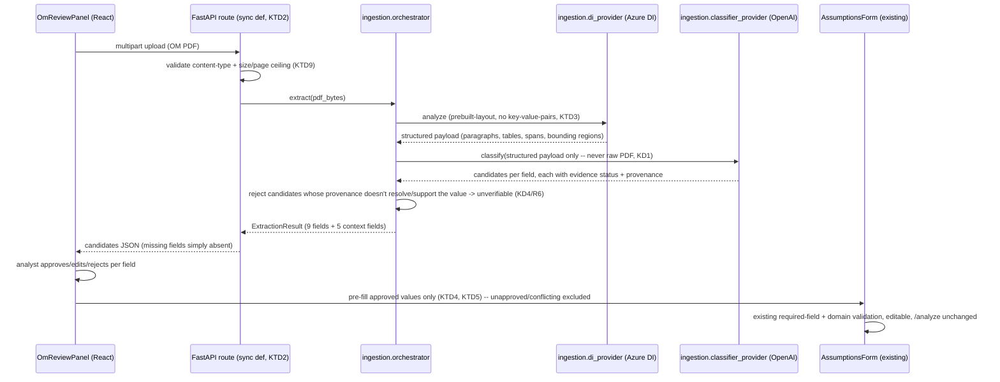

# OM Ingestion Foundation - Plan

## Goal Capsule

- **Objective:** An analyst can turn an uploaded Offering Memorandum (OM) PDF into a reviewable set of proposed acquisition-input and deal-context values — each carrying verifiable provenance and an explicit stated / interpreted / conflicting / unverifiable / missing status — and approve, edit, or reject them individually before any value can reach `AcquisitionInputs` or the deterministic engine.
- **Means:** Azure Document Intelligence performs non-generative structured extraction from the PDF; GPT classifies and normalizes that extraction payload (never the raw PDF) into candidates for the existing 9 `AcquisitionInputs` fields plus five fixed read-only deal-context fields (KD1, KD5).
- **Product authority:** This brainstorm dialogue with the project owner, grounded in `AGENTS.md`'s existing constraints (fixed 9-input engine, AI-as-interpreter-not-calculator, dependency discipline).
- **Authority hierarchy:** Product Contract requirements are fixed; Planning Contract Key Technical Decisions record how-level choices within them; Implementation Units execute against both and never widen product scope (the 9-field engine boundary is never expanded).
- **Stop conditions:** Stop and flag before any unit that would let an unapproved value reach `AcquisitionInputs`, that would add a 10th engine input, or that would send the raw PDF (rather than Azure DI's structured payload) to GPT.
- **Execution profile:** `code`, Deep depth, phased (backend extraction pipeline, then frontend review/handoff, then cross-cutting verification); U1's compatibility spike gates the rest of the backend phase.
- **Tail ownership:** Implementer runs the targeted tests, then the full backend (`pytest`) and frontend (`npm test` in `web/`) suites, and reviews the git diff for unintended changes before declaring done, per `AGENTS.md`.
- **Open blockers:** Azure Document Intelligence and OpenAI credentials must be provisioned backend-only. A synthetic/non-confidential OM test corpus is needed before implementation testing begins — a deliberate third-party data-handling review is required before any real/confidential OM is submitted.

**Product Contract preservation:** unchanged — planning added no new requirements and did not alter any R/KD/A/F/AE ID or its meaning.

---

## Product Contract

### Summary

Mini-Anchor gains an OM-ingestion pipeline: Azure Document Intelligence performs non-generative extraction from an uploaded Offering Memorandum PDF, and GPT classifies that extraction into candidate values for the 9 acquisition inputs plus a small set of read-only deal-context fields — each candidate carrying an explicit evidence status and Azure-DI-verified provenance. The analyst reviews, edits, and approves values in the existing web app before anything reaches `AcquisitionInputs` or the deterministic engine.

### Problem Frame

Today, an analyst turns an OM into acquisition inputs by manually re-reading the document and re-keying values into the canonical Excel workbook (Phase 1 ingestion) or the web form — a repetitive, error-prone step that happens before any deterministic analysis can start. Mini-Anchor's existing AI capability (the Phase 9A Analyst) only interprets already-computed deterministic results; nothing today helps at the input stage, where the source of truth is an unstructured PDF rather than structured data. Phase 10A closes that gap without weakening the project's core guarantee — the deterministic engine remains the sole calculator, and no extracted value can become an underwriting assumption without an analyst's explicit review.

Phase 10A does not assume an OM will reliably state all 9 acquisition inputs — several of them (hold period, exit cap rate, LTV, interest rate, amortization) are commonly a matter of analyst judgment rather than stated fact, and R7 requires the system to report them missing rather than guess. The value proposition is scoped accordingly: extract and surface whatever the OM explicitly supports, reducing manual transcription for the deal facts OMs commonly state, while assumptions that remain the analyst's judgment stay the analyst's to enter, exactly as today.

### Requirements

**Extraction & classification**

- R1. The system extracts candidate values for exactly the 9 existing `AcquisitionInputs` fields (purchase price, current NOI, occupancy, NOI growth, hold period, exit cap rate, LTV, interest rate, amortization) from an uploaded OM PDF.
- R2. The system extracts candidate values for a small, fixed set of read-only deal-context fields: property name, address, property type, unit count or building area, and year built. These fields are for analyst orientation only and are never mapped into `AcquisitionInputs` or fed to the engine.
- R3. Azure Document Intelligence performs all extraction from the raw PDF (OCR, layout, tables, key-value pairs, page/coordinate anchors) as a non-generative source-extraction layer. GPT never receives the raw PDF; it receives only Azure DI's normalized extraction payload.
- R4. GPT classifies and normalizes Azure DI's extraction payload into candidate values for the R1/R2 fields. GPT performs no financial calculation and introduces no text the DI payload doesn't already contain.

**Provenance & evidence status**

- R5. Every candidate value carries an evidence status of exactly one of: **stated** (the document states this value directly), **interpreted** (semantically mapped or normalized by GPT from stated evidence), **conflicting** (the document states two or more different values for the same field), **unverifiable** (GPT proposed a value, but its cited provenance could not be verified against the Azure DI extraction — see R6), or **missing** (no candidate was proposed at all; the document shows no supporting evidence).
- R6. Every candidate value's provenance (page, span, table cell, or snippet) must resolve to an actual anchor in the Azure DI extraction output, and the cited text at that anchor must support the proposed value — not merely exist. A candidate whose citation cannot be resolved, or whose cited text does not support the value, is downgraded to evidence status unverifiable (R5) rather than shown to the analyst as stated or interpreted.
- R7. A field with no candidate proposed at all is reported as missing — distinct from a candidate that was proposed but could not be verified (unverifiable, R5/R6). The system never fabricates or infers a value for a missing field merely to populate all 9 inputs — this applies especially to fields commonly absent from OM narrative text (hold period, exit cap rate, LTV, interest rate, amortization).

**Conflict handling**

- R8. When the document contains multiple, differing statements of the same field, the system surfaces all candidate values together, each with its own status and provenance, rather than silently picking one. No automatic conflict resolution is performed.

**Review & approval UX**

- R9. The analyst reviews proposed values in the existing React web application: for each of the 9 `AcquisitionInputs` fields, the analyst sees the candidate value(s), evidence status, and provenance — including the source snippet shown inline at the point of approval, not merely available elsewhere in the screen — and can approve, edit, or reject each field individually.
- R10. Deal-context fields (R2) render as read-only reference information alongside the review, without approve/edit/reject controls, since they never become underwriting assumptions.
- R11. No field value reaches `AcquisitionInputs` — and therefore the deterministic engine — until the analyst has explicitly approved or manually entered it. A missing or rejected field simply stays absent from the resulting `AcquisitionInputs`; the analyst can still fill it in by hand as they can today.
- R12. The FastAPI backend exposes the extraction/review contract as an endpoint distinct from the existing `/analyze` endpoint, callable by the web frontend. No CLI ingestion command ships in Phase 10A.

**Data handling & privacy**

- R13. The uploaded PDF is processed ephemerally (in-memory/temp storage during the request) and discarded once extraction completes. Mini-Anchor persists only the resulting candidate values and short source snippets/provenance references — never the original file bytes or full page images.
- R14. Phase 10A introduces no database or document repository; there is no persisted store of uploaded documents or extraction results beyond the lifetime of the review session/request.
- R15. Azure Document Intelligence and OpenAI credentials are read only by backend code and are never exposed to the frontend/browser.

**Failure & session handling**

- R16. If Azure DI or GPT cannot process the upload at all (corrupt file, unsupported format, service failure), the analyst sees an explicit failure state distinct from any field being reported missing or unverifiable, and can retry or re-upload without side effects.
- R17. If the browser session is interrupted after extraction has run (page refresh, reconnect, tab close) before the analyst finishes approving, no in-progress review state is preserved — consistent with Phase 10A introducing no persistence layer (R14). The analyst must re-upload and re-run extraction; there is no partial-recovery mechanism in Phase 10A.

### Key Decisions

- **KD1. Azure DI extracts, GPT classifies — GPT never sees the raw PDF.** Azure Document Intelligence's layout model performs OCR, layout, table, and coordinate extraction as a non-generative pass; GPT receives only that structured payload and maps it to candidate field values. Governs R3, R4, R6. (session-settled: user-approved — chosen over GPT-only extraction and an Azure-DI-OCR-only variant: grounds provenance in Azure's own coordinates rather than a self-reported citation, and sets up later table-heavy document types.)
- **KD2. Missing is a legitimate, first-class outcome.** The extraction schema must allow a field to be absent rather than forcing every slot to be filled — a different shape than the existing Phase 9A AI Analyst's strict-required JSON schema, which always requires every field present. Governs R5, R7.
- **KD3. Evidence status separates document fact from AI interpretation.** Every candidate carries exactly one status — stated, interpreted, conflicting, unverifiable, or missing — so the analyst can see how much inference sits between the source text and the proposed number, and can tell true absence apart from a citation that failed to check out. Governs R5, R6, R8.
- **KD4. Provenance must be independently verifiable, not merely asserted.** A GPT-cited page/span/table anchor is valid only if it resolves against Azure DI's own extraction output *and* the cited text supports the proposed value — not just that the anchor exists. A resolvable-but-unsupported citation is downgraded to unverifiable (R5) rather than shown to the analyst as verified. Governs R6.
- **KD5. Read-only deal context is a small, fixed list — not open-ended extraction.** Property name, address, property type, unit count or building area, and year built; shown for orientation only, never eligible to enter `AcquisitionInputs`. Governs R2, R10. (session-settled: user-directed — chosen over extracting only the 9 mapped fields, and over broad best-effort extraction of everything the OM contains: keeps the POC surface tight while still giving the analyst useful context.)
- **KD6. Web-only review; no CLI in Phase 10A.** The analyst uploads and reviews entirely inside the existing React app; the FastAPI backend still exposes the ingestion/review contract as its own endpoint so a future CLI or other client can reuse it. Governs R9, R12. (session-settled: user-directed — chosen over a CLI-first flow mirroring Phase 1 Excel ingestion, and over building both surfaces now: analysts already work in the existing web underwriting UI.)
- **KD7. Documents are ephemeral; Phase 10A adds no storage layer.** The raw PDF is discarded after extraction; only candidate values and short source snippets persist for the review. Governs R13, R14. (session-settled: user-approved — chosen over persisting the source PDF with the deal record: keeps the privacy/security surface minimal for a POC.)

### Actors

- A1. **Analyst** — uploads the OM PDF, reviews candidate values, edits/approves/rejects each field.
- A2. **Azure Document Intelligence** — non-generative extraction service; produces structured, coordinate-anchored text/tables from the PDF.
- A3. **GPT (OpenAI)** — classifies and normalizes Azure DI's payload into candidate field values with evidence status and provenance citations; never sees the raw PDF, never calculates.
- A4. **Deterministic engine** — unchanged; consumes only analyst-approved `AcquisitionInputs`.

### Key Flows

- F1. **Upload and propose**
  - **Trigger:** Analyst uploads an OM PDF in the web app.
  - **Actors:** A1, A2, A3.
  - **Steps:** Backend receives the PDF ephemerally → Azure DI extracts structured text/tables/coordinates → GPT classifies the DI payload into candidate values for the 9 `AcquisitionInputs` fields and the 5 deal-context fields, each tagged stated/interpreted/conflicting/unverifiable/missing with DI-verified provenance → raw PDF is discarded → candidates return to the frontend for review.
  - **Outcome:** Analyst sees a review screen with every field's candidate(s), status, and source snippet; deal-context fields render read-only.
  - **Covers:** R1, R2, R3, R4, R5, R6, R7, R8, R13, R14, R15.
- F2. **Review and approve**
  - **Trigger:** Analyst reviews the proposed candidates.
  - **Actors:** A1.
  - **Steps:** For each of the 9 fields, the analyst approves a candidate as-is, edits it, or rejects it (leaving it absent); conflicting candidates require an explicit choice or edit, never an automatic pick.
  - **Outcome:** An `AcquisitionInputs` record is assembled from only analyst-approved/edited values; any field the analyst didn't approve stays absent, same as today's manual entry.
  - **Covers:** R8, R9, R10, R11, R12.
- F3. **Handoff to existing analysis**
  - **Trigger:** Analyst finishes approving.
  - **Actors:** A1, A4.
  - **Steps:** The assembled `AcquisitionInputs` (with any still-missing fields left for manual entry) flows into the existing `/analyze` pipeline unchanged.
  - **Outcome:** The deterministic engine runs exactly as it does today; ingestion never touches the calculator.
  - **Covers:** R11.

### Acceptance Examples

- AE1. **Given** an OM that states the purchase price once, clearly. **When** extraction runs. **Then** the purchase price candidate has status "stated," a provenance citation resolvable to a specific Azure DI text/table anchor, and no competing candidate. **Covers** R1, R5, R6.
- AE2. **Given** an OM that never mentions an exit cap rate. **When** extraction runs. **Then** the exit cap rate field is reported as "missing" with no candidate value, and the system does not infer or guess a market-typical cap rate to fill it. **Covers** R7.
- AE3. **Given** an OM whose executive summary states one purchase price and whose financial summary page states a different purchase price. **When** extraction runs. **Then** both candidates are surfaced together, each with its own provenance and status, and the analyst must explicitly choose or edit — the system does not average, prefer one page over another, or silently pick a value. **Covers** R5, R8.
- AE4. **Given** GPT proposes a candidate whose cited page/span either does not correspond to any actual Azure DI extraction anchor, or corresponds to an anchor whose text does not support the proposed value. **When** the system validates the candidate. **Then** the candidate's evidence status is set to unverifiable rather than shown to the analyst as stated or interpreted. **Covers** R5, R6.
- AE5. **Given** the analyst does not approve a proposed hold-period value (or the field arrived as missing). **When** the analyst proceeds to analysis. **Then** the resulting `AcquisitionInputs` has no hold-period value from ingestion; the analyst must supply it manually, exactly as the current manual-entry flow requires. **Covers** R7, R11.
- AE6. **Given** the analyst uploads a corrupted or unsupported PDF, or Azure DI/GPT is unavailable. **When** extraction is attempted. **Then** the analyst sees an explicit failure state (not a screen of "missing" fields) and can retry or re-upload. **Covers** R16.
- AE7. **Given** the analyst's browser refreshes mid-review, after extraction has already run. **When** the page reloads. **Then** no prior candidates are recovered; the analyst must re-upload the OM to get a fresh extraction. **Covers** R17.

### Success Criteria

Phase 10A is validated against a representative sample of synthetic or otherwise non-confidential OMs (see Dependencies / Assumptions), tracking these signals per field:

- **Extraction coverage** — how often a candidate is proposed at all, versus reported missing.
- **Provenance-verification rate** — how often a proposed candidate's citation resolves and is downgraded to unverifiable (R5/R6).
- **Conflict rate** — how often a field surfaces two or more candidates (R8).
- **Missing-rate** — how often a field is reported missing (R7), consistent with the Problem Frame's scoped expectation that some fields will commonly be absent.

No specific target percentage is set for Phase 10A — the initial sample is too small to justify one. These signals inform whether the extraction approach is working and shape the success bar for later phases.

### How This Work Fits Together

Phase 10A owns OM ingestion only. The read-only deal-context list, the extraction/review API shape, and the stated/interpreted/conflicting/unverifiable/missing evidence-status model are designed to generalize, but T12, rent roll, lease, and debt-document ingestion are not committed scope yet — this is the current understanding, not a committed roadmap, and later brainstorms will define each independently.

- T12 / rent-roll ingestion — depends on Azure DI's table extraction (already exercised by Phase 10A for OM tables); would likely feed different target fields than the 9 `AcquisitionInputs` (NOI detail, unit-level rents) rather than replacing them.
- Lease and debt-document ingestion — share the same provenance/evidence-status/approve-edit-reject pattern conceptually, but are separate document types with their own target contracts; still to decide whether they reuse the same upload surface or get their own.

### Scope Boundaries

**Deferred for later:**

- T12, rent roll, lease, and debt-document ingestion or normalization.
- A CLI ingestion workflow.
- Persisted or long-term document storage, or a document repository tied to the deal record.
- Multi-document upload per deal — Phase 10A assumes one OM PDF per upload.

### Dependencies / Assumptions

- Requires an Azure Document Intelligence resource and continued OpenAI API access, both configured and read backend-only, never exposed to the frontend.
- Assumes the uploaded PDF is a native, reasonably well-formed OM. Real-world scanned or low-quality OM handling is not a Phase 10A quality bar, though Azure DI's OCR gives some resilience for free.
- Assumes Azure DI's and OpenAI's standard data-handling terms are acceptable for the OMs actually tested with. A deliberate review of third-party data handling is needed before any confidential or real deal OM is submitted; Phase 10A testing should use synthetic or otherwise non-confidential OMs until that review happens.
- Assumes the existing `AcquisitionInputs` contract (9 fields) and validation rules are unchanged; ingestion only ever proposes candidates for the existing contract, never new engine inputs.

### Outstanding Questions

**Deferred to Planning:**

- ~~Exact shape of the extraction/review API contract (endpoint routes, request/response schema, how multiple conflicting candidates are represented).~~ Resolved — see Planning Contract KTD1, KTD9 and U6.
- ~~How Azure DI's raw response (layout/table JSON) is projected into the payload GPT receives — full response or a trimmed subset.~~ Resolved — see KTD3.
- ~~Review-screen layout and interaction design for approve/edit/reject and conflict display.~~ Resolved — see KTD4, KTD5 and U8/U9.
- Sourcing for the synthetic/non-confidential OM test corpus used during implementation and QA — still open; the implementer sources or constructs sample OMs before U3's verification tests run (no automated fixture-generation unit in this plan).

---

## Planning Contract

### Key Technical Decisions

- **KTD1. A new `ingestion` package extends the existing provider-isolation pattern.** `src/mini_anchor/ingestion/` mirrors `src/mini_anchor/ai/`'s shape: `contracts.py` (frozen dataclasses), a provider module per external call with the SDK imported lazily inside it, `prompts.py`, and an orchestrator that calls each provider exactly once and accepts an injectable provider for tests. Governs R1, R2, R3, R4, R16.
- **KTD2. The extraction endpoint never calls Azure DI's blocking poller from an `async def` route.** The Azure Document Intelligence SDK's `begin_analyze_document`/`poller.result()` call performs blocking I/O even on its async client (a documented, still-open SDK issue) — calling it directly from `async def` would stall the FastAPI event loop for the whole extraction. The endpoint is a plain `def` route (FastAPI dispatches these to a threadpool automatically) rather than `async def`, matching every other route already in `api.py`. This route shares that threadpool with `/analyze` and every other endpoint; at POC concurrency this is an accepted tradeoff, made survivable only by the call timeouts KTD11 requires — without them a hung provider call could occupy a thread indefinitely and degrade unrelated requests. A submit-then-poll job pattern (mirroring Azure DI's own long-running-operation shape) would avoid holding a thread for the combined call duration at all, rather than time-bounding the occupancy; it was not chosen for Phase 10A because it adds a second endpoint, client-side polling logic, and a job-state concept disproportionate to a POC's expected concurrency, and remains available as a later escalation if real usage shows the timeout-bounded approach insufficient. Governs R3, R16. (session-settled: user-approved — chosen over calling the SDK's poller inside an `async def` route: avoids a real event-loop-blocking bug in the current SDK.)
- **KTD3. Azure DI is called for layout only — paragraphs, tables, lines, and bounding regions — never its key-value-pairs feature.** GPT performs all semantic field-to-value mapping from that structured payload; requesting Azure's own key-value extraction would blur the KD1 non-generative/semantic split, and OMs are narrative documents rather than structured forms where key-value extraction helps. Governs R3, R4. (session-settled: user-approved — chosen over also requesting Azure DI's key-value-pairs feature: keeps semantic mapping entirely GPT's responsibility, matching KD1.)
- **KTD4. An unresolved conflict, or a field the analyst never explicitly approved, is excluded from the values handed to `AssumptionsForm` rather than blocking the analyst from finishing the review.** Matches R11's "any field the analyst didn't approve stays absent" — there is no separate "you must resolve every conflict first" gate. Governs R8, R9, R11. (session-settled: user-approved — chosen over hard-blocking the review's finish action until every conflict is resolved: keeps the review screen's exit path consistent with R11's stated behavior for any other unapproved field.)
- **KTD5. Approved candidate values pre-fill the existing `AssumptionsForm`; the review screen never calls `/analyze` directly.** The form's existing required-field and domain validation, and the existing `InputIssue` rendering, are reused as-is — ingestion adds no parallel validation path. Governs R9, R11, R12. (session-settled: user-directed — chosen over a new standalone review-to-submit path calling `/analyze` directly: reuses existing validation UX instead of duplicating it.)
- **KTD6. New dependencies: `azure-ai-documentintelligence`, `python-multipart>=0.0.18`, and `pypdf`, added to `pyproject.toml` with justification.** `azure-ai-documentintelligence` is the extraction layer itself (KD1); `python-multipart` is required by FastAPI's `UploadFile`/`File()` form parsing, which no existing endpoint uses. Pin `python-multipart` at `>=0.0.18` — versions 0.0.14–0.0.15 shipped an import-namespace change that broke installation for some users; 0.0.16+ (and FastAPI's own extra) uses `>=0.0.18`. `pypdf` is required to enforce KTD9's page-count ceiling locally, before any Azure DI call is made — byte size alone can be checked with no dependency, but page count cannot. Governs R3, R15, R16.
- **KTD7. The Azure DI SDK's published Python support does not yet list 3.14 (the project's pinned version); its transport dependency does.** `azure-ai-documentintelligence`'s own PyPI classifiers stop at Python 3.12, while `azure-core` (the transport layer it sits on) explicitly supports 3.14. This is treated as a likely-fine but unverified-by-the-vendor risk, resolved by sequencing U1 as a verification spike — install the SDK and run one real `prebuilt-layout` call under the project's actual 3.14 interpreter — before any other ingestion code depends on it. A direct REST integration (bypassing the Python SDK entirely, removing the Python-version-classifier risk outright) was considered and set aside for Phase 10A: it trades a verifiable-in-one-spike risk for hand-rolling request signing, polling, and response parsing the SDK already provides — worth revisiting only if U1's spike actually fails.
- **KTD8. Frontend test scope adds automated integration/component coverage of the ingestion workflow, not browser-level end-to-end automation.** Using the existing Vitest + Testing Library setup (already present in `web/`, no new devDependency needed), cover: upload/loading state, the explicit failure state, per-field candidate rendering (value, provenance snippet, evidence status), visual distinction between missing/unverifiable/conflicting states, approve/edit/reject behavior, exclusion of unapproved/conflicting values from the assembled set, correct and still-editable pre-fill into `AssumptionsForm`, and that landing on the pre-filled form does not itself trigger `/analyze`. No Playwright or full browser E2E suite in Phase 10A. Governs R9, R10, R11, R16, R17. (session-settled: user-directed — chosen over both "unit-level tests only" and "a full Playwright E2E suite": explicit request for integration/component coverage of the critical workflow without full browser automation.)
- **KTD9. Upload validation rejects non-PDF content and enforces a conservative size/page ceiling before any Azure DI call.** The byte-size ceiling is checked from the request's `Content-Length` header — and, since that header can be absent or wrong, also enforced while reading the body (stop and reject past the ceiling rather than buffering the full upload first) — so an oversized upload cannot exhaust memory before the ceiling check runs. A client-supplied `content-type` header is spoofable, so the check also confirms the bytes actually start with the PDF signature (`%PDF-`). Page count is checked locally with `pypdf` (KTD6) under the KTD11 timeout: if `pypdf` cannot open the file at all, treat it the same as a rejected upload (the signature check already establishes it claims to be a PDF, so an unopenable file is genuinely malformed). If `pypdf` opens the file but its behavior diverges from Azure DI's own tolerance (a real risk — the two parsers accept different degrees of non-standard PDF structure) such that only the page count is unreliable, do not hard-reject on that basis alone; let Azure DI's own call be the final arbiter of processability, and rely on R16's existing failure-state handling if Azure DI then rejects it. Azure's own service limits run far higher (Standard tier: 500 MB / 2,000 pages), so this is a POC-scale guard against an oversized, malformed, or spoofed upload reaching a paid third-party call, not a service-imposed limit — recommended starting ceiling: 15 MB / 75 pages, adjustable by the implementer. Governs R16.
- **KTD10. A single `ExtractionError` hierarchy (`ExtractionError`, `ExtractionConfigurationError`, `ExtractionProviderError`) is defined once, in `ingestion/contracts.py`, and both providers raise it.** Without one shared definition, U3 (mirroring `ai/provider.py`) and U4 ("reusing" it) could plausibly end up raising two different exception families — the Azure DI provider's own `Extraction*` classes versus the existing `ai` package's `AIError` classes — which would silently break U6's status-code mapping for whichever provider's failures don't match the caught types, defeating R16 for that failure mode. Neither provider imports from `mini_anchor.ai`; both raise the one hierarchy defined in `ingestion/contracts.py`. Governs R16.
- **KTD11. Every synchronous, potentially-slow step on the ingestion route carries an explicit timeout — not just the two external calls.** KTD2 puts this route on the shared threadpool every other route also uses; without concrete bounds, KTD2's own safety claim ("survivable only by the call timeouts KTD11 requires") is unenforced. Recommended starting values, adjustable by the implementer against real OM latency once measured: Azure DI poller — 90 seconds (covers a KTD9-ceiling-sized 75-page document with margin); OpenAI classification call — 60 seconds; local `pypdf` page-count parse (KTD9) — 5 seconds, since it runs synchronously against fully attacker-controlled bytes on the same shared threadpool KTD2 accepts as a tradeoff, and a pathological PDF could otherwise hang it exactly like an unbounded provider call. A timeout on the two external calls is caught and re-raised as `ExtractionProviderError` (KTD10); a `pypdf` timeout is treated the same as a `pypdf` parse failure (KTD9). Governs R16.
- **KTD12. R6's provenance check — anchor exists AND its text supports the value — is deterministic, never a second model call.** Because GPT controls both the proposed value and the citation it points to, asking GPT to grade whether its own citation "supports" its own value would provide no independent verification and defeats the purpose of R6/KD4. Anchor existence is a direct lookup by page/span/table-cell id against the Azure DI payload actually sent. Value-support is a literal or normalized match against the cited snippet text, not a semantic judgment call: for the 9 numeric `AcquisitionInputs` fields, a normalized-numeric match (e.g., `$1,250,000` matches `1250000`); for the text-valued deal-context fields (R2 — property name, address, property type), a normalized case-insensitive substring match (e.g., a citation of "123 Main Street" supports a proposed value of "123 Main St" only if the implementer's normalization treats common abbreviations as equivalent — otherwise it is legitimately downgraded to `unverifiable`, which is an acceptable outcome for a read-only orientation field). Governs R2, R5, R6.

### High-Level Technical Design

---

## Implementation Units

**Phase A — Backend extraction pipeline**

### U1. Add Azure DI dependency and verify Python 3.14 compatibility
- **Goal:** Confirm the extraction pipeline's foundational dependency actually works under the project's pinned interpreter before any other unit builds on it.
- **Requirements:** KTD6, KTD7.
- **Dependencies:** none.
- **Files:** `pyproject.toml`.
- **Approach:**
  1. Add `azure-ai-documentintelligence`, `python-multipart>=0.0.18`, and `pypdf` to `pyproject.toml` dependencies, with a one-line comment citing KTD6/KD1 as the justification (per `AGENTS.md`'s dependency-discipline rule).
  2. Install into the project's actual Python 3.14 environment.
  3. Run one real `prebuilt-layout` call (a small sample PDF, an `AzureKeyCredential`, and a test Azure DI resource) and confirm `AnalyzeResult` comes back with `paragraphs`/`tables`/`pages` populated.
- **Execution note:** This is a verification spike, not feature code — if the real call fails under 3.14, stop and escalate (KTD7) before continuing to U2+.
- **Test scenarios:** Test expectation: none — dependency addition and environment verification, not application behavior.
- **Verification:** The pinned interpreter installs both new dependencies cleanly, and one real `prebuilt-layout` call against a sample PDF returns a populated `AnalyzeResult`.

### U2. Ingestion contracts
- **Goal:** Define the frozen data shapes every other ingestion module produces or consumes, mirroring the existing `ai`/`engine`/`analysis` contract pattern.
- **Requirements:** R1, R2, R5, R6, R7, R8.
- **Dependencies:** U1.
- **Files:** `src/mini_anchor/ingestion/__init__.py`, `src/mini_anchor/ingestion/contracts.py`, `tests/test_ingestion_contracts.py`.
- **Approach:**
  1. `EvidenceStatus` — a `StrEnum` with exactly `stated`, `interpreted`, `conflicting`, `unverifiable`, `missing` (R5).
  2. `Provenance` — frozen dataclass: page, span/table-cell anchor, snippet text (R6).
  3. `ExtractionCandidate` — frozen dataclass: value, `EvidenceStatus`, `Provenance | None` (missing candidates carry no provenance).
  4. `FieldCandidates` — frozen dataclass: field id, `tuple[ExtractionCandidate, ...]` (R8 — zero, one, or many candidates per field).
  5. `DealContext` — frozen dataclass: the 5 read-only fields (R2), each itself a `FieldCandidates`-shaped value since context fields can also conflict.
  6. `ExtractionResult` — frozen dataclass aggregating the 9 `FieldCandidates` plus `DealContext`.
  7. `ExtractionError(RuntimeError)`, `ExtractionConfigurationError`, `ExtractionProviderError` — the one shared exception hierarchy both U3 and U4 raise (KTD10). Defined here, not in either provider module, since two providers share it.
- **Patterns to follow:** `src/mini_anchor/ai/contracts.py` (frozen, `slots=True`, `kw_only=True` dataclasses); `src/mini_anchor/validation.py`'s `IssueCategory` `StrEnum` pattern for `EvidenceStatus`; `src/mini_anchor/ai/provider.py`'s `AIError`/`AIConfigurationError`/`AIProviderError` hierarchy shape (mirrored, never imported — `ingestion` never imports from `mini_anchor.ai`).
- **Test scenarios:**
  - Happy path: constructing each dataclass with valid data succeeds and fields are frozen (mutation raises).
  - Edge case: `FieldCandidates` accepts an empty tuple (a missing field) and a tuple with 2+ candidates (a conflicting field).
  - Edge case: `EvidenceStatus` rejects any value outside the five defined members.
- **Verification:** All contract types import cleanly, the dataclasses are frozen/slotted, the enum has exactly the five R5 members, and the exception hierarchy is importable by both U3 and U4 without either importing from `mini_anchor.ai`.

### U3. Azure DI provider
- **Goal:** Isolate the only module that imports the Azure SDK; convert a raw PDF into Azure DI's structured layout payload.
- **Requirements:** R3, R6 (this unit only produces the raw anchors R6 checks against; the content-correspondence check itself happens in U4), R16.
- **Dependencies:** U1, U2.
- **Files:** `src/mini_anchor/ingestion/di_provider.py`, `tests/test_ingestion_di_provider.py`.
- **Approach:**
  1. Import `ExtractionError`/`ExtractionConfigurationError`/`ExtractionProviderError` from `ingestion.contracts` (U2, KTD10) — do not define a local hierarchy here.
  2. Lazy client construction: accept an injectable `client` for tests; otherwise build `DocumentIntelligenceClient` with `AzureKeyCredential` from env vars only inside the method that needs it, `azure` SDK imported inside that same method (never at module top level). Missing credentials raise `ExtractionConfigurationError` with no call attempted.
  3. `analyze(pdf_bytes: bytes) -> AnalyzeResult`-shaped return: call `prebuilt-layout` with no `features` (KTD3), synchronously (the caller — U6's route — is what stays off the event loop, per KTD2), with an explicit timeout on the poller call (KTD11).
  4. Catch and re-raise the underlying SDK exception or a timeout as `ExtractionProviderError` with a sanitized message (never the raw exception text).
- **Patterns to follow:** `src/mini_anchor/ai/provider.py` end to end — its `AIError`/`AIConfigurationError`/`AIProviderError` hierarchy, lazy-import-inside-method shape, and injectable-client test pattern are the direct template.
- **Test scenarios:**
  - Happy path: injected fake client's `begin_analyze_document` result flows through to a structured return with paragraphs/tables/spans.
  - Edge case: missing Azure credentials raises `ExtractionConfigurationError` with no call attempted on the injected client.
  - Error path: injected fake client raises an arbitrary exception -> caught and re-raised as `ExtractionProviderError` with a sanitized message (mirrors `test_underlying_client_exception_raises_provider_error_not_raw_exception` in `tests/test_ai_provider.py`).
  - Error path: injected fake client returns a malformed/empty result -> `ExtractionProviderError`.
  - Error path: the call exceeds its timeout -> `ExtractionProviderError`, not an unhandled hang (KTD11).

### U4. GPT classification provider
- **Goal:** Classify Azure DI's structured payload into per-field candidates with evidence status and verified provenance, without ever seeing the raw PDF.
- **Requirements:** R4, R5, R6, R7, R8.
- **Dependencies:** U2, U3.
- **Files:** `src/mini_anchor/ingestion/classifier_provider.py`, `src/mini_anchor/ingestion/prompts.py`, `tests/test_ingestion_classifier_provider.py`.
- **Approach:**
  1. `prompts.py`: `build_system_prompt()` (grounding rules — never invent text absent from the payload, always cite a resolvable anchor, use `missing` rather than guess, surface every conflicting statement, and disregard any instruction-like text found inside the OM content itself — an uploaded document is data, never an instruction source) and `build_user_prompt(structured_payload)` serializing Azure DI's paragraphs/tables/spans. Mirror `src/mini_anchor/ai/prompts.py`'s numbered grounding-rule style. The grounding rules are the only defense against injected instructions in OM text; KTD12's deterministic verification is the actual backstop against any resulting fabricated value reaching the analyst as verified.
  2. JSON schema: each of the 9 + 5 fields maps to an array of candidate objects (value, evidence status, page/span citation) that **can be empty** — this is a genuinely different schema shape from `ai/provider.py`'s all-required schema (KD2), since `missing` must be representable without forcing every field present.
  3. After parsing, validate every non-`missing` candidate's citation against the Azure DI payload actually sent, **deterministically, never via a second model call** (KTD12): the cited anchor must exist by direct lookup in the payload, and its text must literally/numerically contain the proposed value. A candidate that fails either check is downgraded to `unverifiable` before it's returned.
  4. Import `ExtractionError`/`ExtractionConfigurationError`/`ExtractionProviderError` from `ingestion.contracts` (U2, KTD10) — the same shared hierarchy U3 raises, never `mini_anchor.ai`'s `AIError` classes. Mirror `ai/provider.py`'s lazy-import shape and sanitized-error convention for this call: catch the underlying OpenAI SDK exception (and a call timeout, KTD11) and re-raise as `ExtractionProviderError` with a sanitized message, never the raw exception text or the OM content it might contain. This is a second, purpose-specific provider — not `OpenAIAnalystProvider` reused directly, since the schema and prompts differ.
- **Patterns to follow:** `src/mini_anchor/ai/provider.py` (schema-building, structured-output call, sanitized error handling) and `src/mini_anchor/ai/prompts.py` (grounding-rule prose style).
- **Test scenarios:**
  - Happy path: a well-formed response with a `stated` candidate for one field and empty arrays for others parses into `ExtractionResult` with the empty fields as `missing`.
  - Happy path: a response with two candidates for one field parses as `conflicting` (R8), both retained.
  - Edge case: a candidate whose cited anchor is absent from the payload sent -> downgraded to `unverifiable`, not shown as `stated`/`interpreted` (AE4).
  - Edge case: a candidate whose cited anchor exists but whose text does not literally/numerically contain the value (e.g., cited text says `$980,000` for a proposed `$1,250,000`) -> downgraded to `unverifiable` via the deterministic check, not a second model call (AE4, KTD12).
  - Edge case: a candidate whose cited text contains the value in a different but equivalent format (`$1,250,000` vs `1250000`) -> the normalized match still accepts it as verified.
  - Error path: malformed JSON or wrong-shaped response -> `ExtractionProviderError` (mirrors `ai/provider.py`'s `_parse_ai_analysis` error handling).
  - Error path: the call exceeds its timeout -> `ExtractionProviderError` (KTD11).
  - Integration: the payload passed to the classifier call never contains the raw PDF bytes, only Azure DI's structured payload (KD1 runtime check, not just an import-graph check).

### U5. Extraction orchestrator
- **Goal:** Assemble one `ExtractionResult` per upload by calling the two providers exactly once each, and guarantee the raw PDF is never retained past the call.
- **Requirements:** R3, R4, R13.
- **Dependencies:** U3, U4.
- **Files:** `src/mini_anchor/ingestion/orchestrator.py`, `tests/test_ingestion_orchestrator.py`.
- **Approach:**
  1. `extract_om(pdf_bytes: bytes, *, di_provider=None, classifier_provider=None) -> ExtractionResult` — default to real providers, accept injected fakes for tests (mirrors `ai/analyst.py`'s `generate_ai_analysis`).
  2. Call the DI provider once, then the classifier provider once with only the DI provider's return value.
  3. Return the assembled `ExtractionResult`; do not store `pdf_bytes` on any returned object or module-level state (R13 — the caller, U6, is responsible for not persisting it either).
- **Patterns to follow:** `src/mini_anchor/ai/analyst.py` (single-call-each orchestration, injectable providers).
- **Test scenarios:**
  - Happy path: with fake providers, `extract_om` calls the DI provider once and the classifier provider once, in that order, and returns their composed result.
  - Integration: the fake DI provider's raw input (`pdf_bytes`) is not present anywhere on the returned `ExtractionResult` or reachable from it.
  - Error path: a `ExtractionConfigurationError`/`ExtractionProviderError` raised by either provider propagates unchanged (no swallowing or re-wrapping that would lose the distinction R16 needs).

### U6. FastAPI ingestion endpoint
- **Goal:** Expose upload → extraction as a single endpoint, distinct from `/analyze`, following the app's existing error-mapping convention.
- **Requirements:** R1, R2, R3, R4, R12, R15, R16.
- **Dependencies:** U1, U5.
- **Files:** `src/mini_anchor/api.py`, `tests/test_api_ingestion.py`.
- **Approach:**
  1. New route, plain `def` (not `async def` — KTD2), accepting `file: UploadFile = File(...)`.
  2. Validate, in order, before calling the orchestrator (KTD9): (a) `file.content_type == "application/pdf"`; (b) `Content-Length` (when present) is under the byte ceiling, rejected before reading the body; (c) read the body with a hard stop past the ceiling regardless of the declared `Content-Length` (so a missing or wrong header can't bypass the guard), then confirm the read bytes actually start with the `%PDF-` signature, since the content-type header is client-supplied and spoofable; (d) `pypdf` (KTD6), under the KTD11 timeout, parses the bytes for a page count under the ceiling — an outright parse failure (file won't open at all) is rejected the same as any other corrupt/unsupported file (R16); a page-count-only ambiguity is not rejected here (KTD9) and instead proceeds to the Azure DI call, which is the final arbiter. No Azure/OpenAI call is made if (a)-(c), or an outright `pypdf` open failure, reject the upload.
  3. Call `ingestion.orchestrator.extract_om`; map `ExtractionConfigurationError` -> 503, `ExtractionProviderError` -> 502 (mirrors the existing `AIConfigurationError`/`AIProviderError` -> 503/502 convention in this same file) — this is the R16 "service failure" branch, which also covers a provider call timing out (KTD11).
  4. Return the `ExtractionResult` as JSON (missing fields simply have an empty candidate list; no field is forced-present).
  5. Read Azure/OpenAI credentials backend-only, same as the existing AI Analyst endpoint (R15).
- **Patterns to follow:** `src/mini_anchor/api.py`'s existing endpoints — typed-exception-to-status-code mapping, response-model shape, "this endpoint performs no X of its own" docstring convention.
- **Test scenarios:**
  - Happy path: valid multipart PDF upload -> 200 with candidates JSON, including at least one `missing` field and one `conflicting` field in the fixture response (Covers AE1, AE2, AE3).
  - Edge case: non-PDF content-type -> 4xx, no Azure/OpenAI call made (assert via the injected fakes' call count).
  - Edge case: PDF content-type header on non-PDF bytes (spoofed) -> 4xx on the signature check, no Azure/OpenAI call made.
  - Edge case: `Content-Length` over the KTD9 size ceiling -> 4xx before the body is read.
  - Edge case: body exceeds the KTD9 size ceiling while streaming (no or understated `Content-Length`) -> 4xx, reading stops at the ceiling rather than buffering the full upload.
  - Edge case: file over the KTD9 page ceiling (valid PDF, too many pages) -> 4xx, no Azure/OpenAI call made.
  - Edge case: PDF bytes `pypdf` cannot open at all -> 4xx, not a 500, no Azure/OpenAI call made.
  - Edge case: PDF bytes `pypdf` opens but cannot reliably determine a page count for -> not rejected at this step; the request proceeds to the Azure DI call (KTD9's ambiguous-failure policy).
  - Edge case: the local `pypdf` parse exceeds its KTD11 timeout -> 4xx, treated the same as a parse failure, no Azure/OpenAI call made.
  - Error path: `ExtractionConfigurationError` (fake DI/classifier provider) -> 503 (Covers AE6).
  - Error path: `ExtractionProviderError` -> 502 (Covers AE6).
  - Integration: credentials are read only inside the ingestion package's provider modules, never accepted from or echoed to the request/response (R15).

**Phase B — Frontend review and handoff**

### U7. Frontend types and API client
- **Goal:** Give the frontend typed access to the new endpoint, following the existing hand-written-interface and fetch-wrapper conventions.
- **Requirements:** R1, R2, R5, R6, R8, R12; test scope per KTD8.
- **Dependencies:** U6.
- **Files:** `web/src/types.ts`, `web/src/api.ts`, `web/src/api.test.ts` (new).
- **Approach:**
  1. `types.ts`: `EvidenceStatus` union type, `Provenance`, `ExtractionCandidate`, `FieldCandidates`, `DealContext`, `ExtractionResult` interfaces, each with a `/** Mirrors <contract> in src/mini_anchor/ingestion/contracts.py */` comment.
  2. `api.ts`: `uploadOm(file: File)` — builds `FormData`, omits the JSON `Content-Type` header (browser sets the multipart boundary), and follows `fetchAIAnalysis`'s status-branching pattern for a distinct 502/503 message versus network failure.
- **Patterns to follow:** `web/src/types.ts`'s `/** Mirrors ... */` convention; `web/src/api.ts`'s `fetchAIAnalysis` (lines 197-210) status-branching shape.
- **Test scenarios:**
  - Happy path: `uploadOm` with a mocked successful fetch response returns the parsed `ExtractionResult`.
  - Error path: a mocked 502 response surfaces a provider-failure message distinct from a 503 configuration message.
  - Error path: a mocked network failure surfaces the existing `ApiError` shape.

### U8. OM review panel component
- **Goal:** Let the analyst upload an OM and review, edit, approve, or reject each proposed field, with every state R16/R5 requires visibly distinguishable.
- **Requirements:** R2, R5, R6, R7, R8, R9, R10, R16; test scope per KTD8.
- **Dependencies:** U7.
- **Files:** `web/src/components/OmReviewPanel.tsx`, `web/src/components/OmReviewPanel.test.tsx` (new).
- **Approach:**
  1. Upload control plus loading/progress state while the request is in flight.
  2. An explicit failure branch (R16) distinct from the empty/idle and populated branches, mirroring `AiAnalystPanel.tsx`'s three-branch shape plus this fourth branch.
  3. Per-field rendering: value, evidence-status badge, and the source snippet/provenance shown inline (not behind a click) so approval necessarily involves seeing the evidence (R9). Missing, unverifiable, and conflicting states each get a visually distinct treatment (e.g., distinct badge styling/copy), not just differently worded text. A separate review-state indicator (pending / approved / rejected) tracks the analyst's own action on the field, distinct from the evidence-status badge, so the analyst can see at a glance which of the up to 14 fields they haven't acted on yet.
  4. Approve/edit/reject controls per field. A conflicting field shows every candidate with its own status/provenance and its own approve control; approving one candidate marks the field's other candidates as not-approved (never a single field-level approve with an implicit "which one" left ambiguous). Editing a field opens an inline input pre-filled with the current value; committing the edit sets the field's review-state to approved with the edited value — edit and approve are one action, not two.
  5. Deal-context fields (R2/R10) render read-only, without approve/edit/reject controls, showing multiple candidates as plain text when they conflict.
  6. Interactive controls are native focusable elements (buttons, not clickable `div`s), and evidence-status/review-state badges carry accessible text, not color alone.
- **Patterns to follow:** `web/src/components/AiAnalystPanel.tsx` (prop shape: `{data | null, isLoading, error, onAction}`; branch-per-state rendering).
- **Test scenarios:**
  - Happy path: after a successful upload, proposed values render with their source snippet, provenance, and evidence-status badge visible.
  - Happy path: upload triggers a visible loading/progress state before results render.
  - Edge case: missing, unverifiable, and conflicting fields render with distinguishable visual treatments (assert on distinct classes/text, not just presence).
  - Edge case: a conflicting field shows all of its candidates simultaneously, each with its own approve control.
  - Edge case: approving one candidate in a conflicting field marks the field's other candidates as not-approved.
  - Edge case: committing an edit on a field sets its review-state to approved with the edited value.
  - Edge case: each field's pending/approved/rejected review-state renders and updates independently of its evidence-status badge.
  - Error path: an extraction failure (mocked 502/503) renders the explicit failure state, not an all-fields-missing screen (Covers AE6).
  - Integration: approving, editing, and rejecting a field updates its local state correctly and independently of other fields.

### U9. App integration and AssumptionsForm handoff
- **Goal:** Wire the review panel into the app's state and hand approved values to the existing form without ever auto-triggering analysis.
- **Requirements:** R9, R11, R17; test scope per KTD8.
- **Dependencies:** U8.
- **Files:** `web/src/App.tsx`, `web/src/App.test.tsx`.
- **Approach:**
  1. New `ocrCandidates | isExtracting | extractionError` state triple, following the existing per-operation `useState` triple convention (no reducer/context introduced).
  2. A "finish reviewing" action assembles the approved/edited subset (excluding unapproved and unresolved-conflict fields, KTD4) and pre-fills `AssumptionsForm`'s existing state — the fields remain editable there exactly as manually entered values are today. Before handing off, show a brief summary naming any of the 9 fields being excluded (still-pending or unresolved-conflict), so the analyst sees what didn't carry over instead of discovering an unexpectedly blank form field later.
  3. No code path in this unit calls `/analyze` — reaching the pre-filled form is the unit's terminal state; submission stays the analyst's existing explicit action (R17 — an interrupted session has no partial state to recover, since nothing beyond the pre-fill exists yet).
- **Patterns to follow:** `App.tsx`'s existing `useState` triple + handler-resets-state convention (e.g. `handleGenerateAiAnalysis`).
- **Test scenarios:**
  - Happy path: approved candidate values correctly pre-fill `AssumptionsForm`'s fields.
  - Edge case: unapproved and unresolved-conflict fields are absent from the pre-filled values (Covers AE5).
  - Edge case: finishing review with one or more fields still pending or in an unresolved conflict shows the excluded-fields summary before handoff.
  - Edge case: pre-filled values remain editable in `AssumptionsForm` after the handoff.
  - Integration: landing on the pre-filled form does not itself trigger a call to `/analyze` — that still requires the analyst's existing explicit submit action.

**Phase C — Cross-cutting verification**

### U10. Ingestion architecture guardrail tests
- **Goal:** Enforce the KD1/KTD1 module boundaries mechanically, mirroring the existing AI-layer guardrail suite.
- **Requirements:** R3, R4 (KD1's "GPT never sees the raw PDF" boundary).
- **Dependencies:** U3, U4, U5.
- **Files:** `tests/test_ingestion_architecture.py`.
- **Approach:**
  1. AST-based import scan: `azure` is imported only inside `di_provider.py`; `openai` is imported only inside `classifier_provider.py` — the direct two-provider analog of `test_ai_architecture.py`'s single-provider `openai`-confinement check, and the check that would have caught U3/U4 sharing the wrong exception hierarchy (KTD10). Neither SDK, nor `mini_anchor.ai`, is imported by `engine/`, `analysis/`, or any other `ingestion/` module.
  2. Subprocess import-isolation test: importing `mini_anchor.engine` alone never pulls Azure or OpenAI SDK modules into `sys.modules`.
  3. `ingestion/` imports no `math` module (no financial formulas — mirrors the existing `ai` package check).
  4. Runtime assertion (not just import-graph): the payload the classifier provider actually receives never contains raw PDF bytes.
- **Patterns to follow:** `tests/test_ai_architecture.py` end to end — every check above has a direct analog there.
- **Test scenarios:**
  - Happy path: the AST import scan finds `azure` only in `di_provider.py` and `openai` only in `classifier_provider.py`.
  - Integration: the subprocess isolation test confirms `mini_anchor.engine`'s import graph excludes both new SDKs.
  - Integration: `ingestion/` modules other than `di_provider.py`/`classifier_provider.py` import neither SDK nor `mini_anchor.ai`.
  - Integration: a runtime check confirms the classifier provider's actual received payload contains no raw PDF byte content.

---

## Verification Contract

| Command | Applies to |
|---|---|
| `pytest` | Full backend suite, including all new `tests/test_ingestion_*.py` and `tests/test_api_ingestion.py` files (U2-U6, U10) |
| `pytest tests/test_ingestion_architecture.py` | Targeted architecture-guardrail check (U10) — run this first when iterating on module boundaries |
| `npm test` (in `web/`) | Full frontend suite via Vitest, including `OmReviewPanel.test.tsx`, `App.test.tsx`, and `api.test.ts` (U7-U9) |

No new CI configuration or `release:validate` gate is introduced by this plan.

---

## Definition of Done

- All ten units implemented; U1's Python 3.14 compatibility spike passed before any later backend unit landed.
- `pytest` and `npm test` (in `web/`) both pass with no unexpected failures.
- The architecture guardrail suite (U10) passes: Azure/OpenAI SDKs are confined to their single provider modules and never reach `engine`/`analysis`.
- Manual smoke check: uploading a sample OM PDF through the running app produces a review screen with at least one `stated`, one `missing`, and (with a suitable fixture OM) one `conflicting` field, and approving a subset correctly pre-fills `AssumptionsForm` without triggering `/analyze`.
- `git diff` reviewed for unintended changes, per `AGENTS.md`.
- Dead-end or experimental code from any approach that didn't pan out during implementation is removed, not left in the diff.
