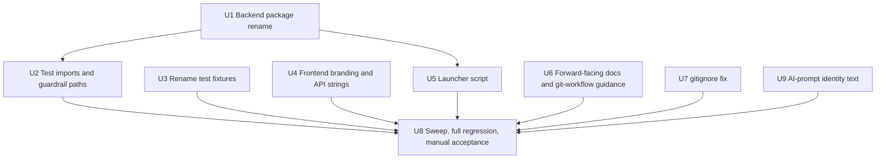

# Anchor Bootstrap Migration - Plan

## Goal Capsule

- **Objective:** Every active code path, running API response, UI surface, launcher, and currently-maintained doc in this repo presents a single, consistent "Anchor" identity — no live reference to "Mini-Anchor" remains outside the historical record — while every previously-verified financial, ingestion, and AI behavior continues to pass its existing automated suite and manual acceptance check unchanged.
- **Means:** Rename the Python package (`src/mini_anchor` → `src/anchor`) and every import, entry point, test, fixture, frontend string, AI-prompt identity reference, launcher reference, and forward-facing doc that names it; leave completed-phase historical documents untouched (KD1).
- **Authority hierarchy:** `AGENTS.md`/`CLAUDE.md` project rules > the user's explicit scope constraints from this conversation > this plan > implementer judgment on unlisted mechanical details.
- **Stop conditions:** Stop and ask before touching anything under `docs/solutions/`, `docs/financial_conventions.md`, `docs/phase_*.md`, or `docs/plans/` (historical record, KD1); before changing financial, engine, ingestion, sensitivity, break-even, AI Analyst, or provenance *logic* — a pure "Mini-Anchor" → "Anchor" identity substitution inside the AI system prompts is explicitly in scope (KD5) and is not a logic change; before renaming any `ANCHOR_*`/Azure/OpenAI environment variable (KD3); before merging any of the ten stacked Mini-Anchor phase branches into `main`; before adding CI, automation, or new tooling.
- **Execution profile:** Single feature branch (`feature/anchor-bootstrap`, already checked out from `main`). Units are mostly independent and mechanical; U8 is the only hard fan-in gate.
- **Tail ownership:** The implementer runs the full backend and frontend regression suites plus the manual end-to-end smoke pass (U8) and reviews `git diff` for unintended changes before declaring the migration done. No merge to `main` is part of this plan.

---

## Product Contract

### Summary

This plan renames Mini-Anchor to Anchor across the active codebase: the Python package, entry points, tests, fixtures, frontend branding, AI-prompt identity text, launcher script, and forward-facing docs move to Anchor identity. Completed-phase historical documents keep their original Mini-Anchor references as an accurate record. No financial, ingestion, sensitivity, break-even, AI Analyst, or provider *behavior* changes.

### Problem Frame

This repository is a preserved copy of the completed Mini-Anchor proof of concept, now being carried forward under the product name Anchor. The rename touches roughly 60 files across a Python/FastAPI backend and a React/TypeScript frontend, so a purely mechanical change carries real risk of a missed reference — either a cosmetic one (a stray "Mini-Anchor" string) or a structural one (a hardcoded path that silently stops enforcing an architecture guardrail). The repo's own institutional-learnings library already anticipated this exact migration and named what must survive it unchanged (`docs/solutions/workflow-issues/feature-branch-workflow-and-anchor-migration-checklist.md`) — this plan operationalizes that checklist into ordered, verifiable units. A document-review pass (five reviewer personas plus direct codebase verification) found several concrete gaps in the plan's first draft — a requirement with no owning unit, an unaddressed second test fixture, live "Mini-Anchor" text inside the AI system prompts, and an inaccurate claim about `.env.example` — all resolved below.

### Requirements

**Backend package & metadata**
- R1. The Python package directory moves from `src/mini_anchor` to `src/anchor` via `git mv`, preserving file history. Every internal import stays unchanged, since all imports inside the package are already relative (`.engine`, `.ai`, `.analysis`, `.ingestion`, `.contracts`, …).
- R2. `pyproject.toml`'s `[project] name` becomes `"anchor"`; its description drops "Mini-Anchor" in favor of "Anchor" while keeping the "real estate acquisition analysis proof of concept" framing.
- R3. `src/anchor/api.py`'s `FastAPI(title=...)` becomes `"Anchor API"`.
- R4. `src/anchor/cli.py`'s argparse `prog` and description text drop "mini_anchor"/"Mini-Anchor" in favor of "anchor"/"Anchor".

**Tests**
- R5. Every test file's absolute import (`from mini_anchor.X import Y` / `import mini_anchor.X`), every `mock.patch("mini_anchor…")` string target, and every subprocess command-string literal that names the package (e.g. `tests/test_engine_contracts.py:359-364`'s `python -c "import mini_anchor.engine; ..."` string) updates to `anchor`. This touches all ~30 files under `tests/*.py` that import the package.
- R6. Every architecture-guardrail test constant that hardcodes the package name as a string rather than deriving it from an imported module's `__file__` updates to `"anchor"`: `tests/test_ai_architecture.py:41-42` (`_ENGINE_DIR`, `_ANALYSIS_DIR`), `tests/test_ingestion_architecture.py:28-29` (`_ENGINE_DIR`, `_ANALYSIS_DIR`), and `tests/test_engine_contracts.py:333` (`engine_dir`, inside `test_engine_package_contains_only_expected_phase_2a_2b_2c_2d_modules`). The first two fail *silently* if missed — `Path.glob()` on a wrong directory returns an empty iterator, so the guardrail reports success while checking nothing. The third fails *loudly* if missed — its set-equality assertion breaks against an empty set — but still needs the same edit. Verification must confirm the first two globs are non-empty post-rename, not just that `pytest` exits green (KTD2).
- R7. `tests/fixtures/mini_anchor_synthetic_om_test.pdf` is renamed via `git mv` to `tests/fixtures/anchor_synthetic_om_test.pdf` — no automated test references this filename (verified: neither `test_ingestion_di_provider.py` nor `test_ingestion_classifier_provider.py` names it; both build synthetic PDF bytes in-memory), so only the manual OM-upload smoke pass in U8 verifies this rename. `examples/mini_anchor_input.xlsx` is separately renamed via `git mv` to `examples/anchor_input.xlsx`, with the `EXAMPLE_WORKBOOK` constant in `tests/test_cli.py:20` and `tests/test_excel_reader.py:69` updated to match.

**Frontend & API surface**
- R8. `web/index.html`'s `<title>`, `web/src/App.tsx:321`'s `<h1>`, and the five repeated "Could not reach the Mini-Anchor API" strings in `web/src/api.ts` (lines 41, 81, 131, 183, 240) update to Anchor branding/wording, with the matching regex assertion in `web/src/api.test.ts:132` updated to match.
- R9. Every "Mini-Anchor" identity reference in doc-comments, module docstrings, and user-visible runtime strings across `src/anchor/**/*.py` and `web/src/{types.ts,convert.ts,format.ts}` updates to "Anchor" — both file-path citations (e.g. `src/mini_anchor/...` references) and prose product-name mentions. This explicitly includes `src/anchor/report.py:44`'s CLI report header `"MINI-ANCHOR ACQUISITION ANALYSIS"` (asserted on by `tests/test_cli.py:28`, updated in lockstep) and the module docstrings in `excel_reader.py` and the `analysis/`, `ai/`, `engine/`, `ingestion/` `__init__.py` files. This does **not** include the AI/ingestion system-prompt constants — see R10.

**AI identity**
- R10. `src/anchor/ai/prompts.py`'s `SYSTEM_PROMPT` constant and `src/anchor/ingestion/prompts.py`'s prompt constant — the literal text sent to the OpenAI API — substitute every "Mini-Anchor" occurrence with "Anchor" as identity-only text. Every grounding rule, numbered instruction, and constraint the prompt states carries forward unchanged in wording and meaning otherwise; this is not a change to AI Analyst or ingestion-classifier logic.

**Launcher & documentation**
- R11. `Launch Mini-Anchor.bat` is renamed via `git mv` to `Launch Anchor.bat`, with its window titles, echo text, and the uvicorn target (`mini_anchor.api:app` → `anchor.api:app`) updated.
- R12. `README.md`, `AGENTS.md`, and `CLAUDE.md` — the repo's current, forward-facing identity and agent-guidance docs — present "Anchor" as the product name, while every other documented rule (Core Architecture Rule, Development Discipline, Testing ritual, Current POC Scope, Development Sequence) carries forward unchanged in meaning.
- R13. Completed-phase historical documents (`docs/financial_conventions.md`, `docs/phase_1_excel_ingestion.md`, `docs/phase_2_deterministic_engine.md`, `docs/plans/2026-08-26-1343-feat-om-ingestion-foundation-plan.md`, everything under `docs/solutions/`) are left untouched — their "Mini-Anchor" references remain as the accurate historical record of the completed POC.
- R14. `AGENTS.md`'s Git section is rewritten as forward-looking documentation to state that `main` is intended to track the latest approved state going forward. This is a documentation change only — no phase branch is merged into `main` and no CI/automation is added as part of this plan.

**Migration hygiene & verification**
- R15. `.gitignore` line 43 (currently the malformed `credentials.json.pytest-temp/`) splits into two correct entries: `credentials.json` and `.pytest-temp/`, with the file confirmed to end in a trailing newline afterward — the original bug was caused by a prior edit appending text onto an unterminated last line, and a missing trailing newline would let the same silent-concatenation failure recur.
- R16. `ANCHOR_AI_MODEL`, `ANCHOR_INGESTION_MODEL`, `AZURE_DOCUMENTINTELLIGENCE_ENDPOINT`, `AZURE_DOCUMENTINTELLIGENCE_KEY`, and `OPENAI_API_KEY` are confirmed already Anchor/provider-branded and are **not** renamed. `.env.example` currently lists only `OPENAI_API_KEY` and `ANCHOR_AI_MODEL` — the other three names are correct wherever they appear, but `.env.example` itself is incomplete; completing it is out of this migration's scope (see Scope Boundaries).
- R17. A repo-wide case-insensitive search for `mini[-_]anchor`, run via `git grep` (which naturally excludes gitignored files) and excluding `docs/`, `.git/`, `node_modules/`, and any `.venv/`, returns zero matches after the migration. `.env`'s `AZURE_DOCUMENTINTELLIGENCE_ENDPOINT` value legitimately contains "mini-anchor" as part of a real external Azure resource hostname — not a renamable code identifier — and is excluded from the sweep because it is gitignored and `git grep` does not see it.
- R18. The full backend suite (`pytest`, from repo root) and full frontend suite (`vitest` via `npm test` in `web/`) both pass with the same test count as the pre-migration baseline, and a manual end-to-end smoke pass confirms Excel ingestion, OM ingestion (Azure DI), the AI Analyst, sensitivity, and break-even all still function against the renamed package.

### Key Decisions

- KD1. **Historical POC documentation is preserved verbatim, not mechanically renamed.** Governs R13. *(session-settled: user-directed — chosen over rewriting all "Mini-Anchor" references across `docs/`: preserves the phase docs and solutions library as an accurate historical record of the completed POC rather than rewriting history.)*
- KD2. **Git-workflow guidance changes are documentation-only.** Governs R14. *(session-settled: user-directed — chosen over introducing CI or automation to enforce a main-tracks-latest policy: keeps this migration plumbing-only.)*
- KD3. **`ANCHOR_*` and provider env vars are confirmed, not renamed.** Governs R16. *(session-settled: user-directed — chosen over a precautionary env-var rename: research confirmed they are already Anchor-branded, so renaming would be churn with no identity benefit.)*
- KD4. **The `.gitignore` credentials.json fix rides along in this migration as a small, explicitly-scoped unit.** Governs R15. *(session-settled: user-directed — chosen over deferring to a separate follow-up, after the live credential-exposure gap was surfaced during research.)*
- KD5. **The AI/ingestion system-prompt text is rewritten as an identity-only substitution, not left as a Stop-Condition carve-out.** Governs R10. *(session-settled: user-directed — chosen over leaving "Mini-Anchor" in the live system-prompt text, after document review found the string embedded in the API-bound prompt and flagged the ambiguity against the Stop Conditions; the user confirmed a pure name substitution with no wording change to any grounding rule is in scope.)*

---

## Planning Contract

### Key Technical Decisions

- KTD1. **Rename via `git mv`, then text substitution.** Every directory, file, and fixture rename in this plan (`src/mini_anchor` → `src/anchor`, `Launch Mini-Anchor.bat`, both test fixtures) uses `git mv` to preserve blame/history, followed by a plain text-substitution pass for remaining string occurrences — never delete-and-recreate. Matches `AGENTS.md`'s "do not rewrite existing Git history" rule.
- KTD2. **Verify guardrail globs are non-empty before trusting a green `pytest` run.** Governs R6. `Path.glob()` on a missing or wrong directory returns an empty iterator, not an error — a renamed-but-broken `_ENGINE_DIR`/`_ANALYSIS_DIR` constant in `test_ai_architecture.py` or `test_ingestion_architecture.py` would let those provider-isolation guardrails report success while checking nothing. `test_engine_contracts.py:333`'s equivalent constant shares the same edit but not the same risk — its set-equality assertion fails loudly instead. U2 and U8 both check the two silent-failure-risk files' emptiness explicitly, not just the suite's exit code.
- KTD3. **Sequence backend before the launcher.** Rename and green-light the backend package (U1 → U2) before touching the launcher (U5), so the launcher's `uvicorn` target can be verified against an already-renamed package. The frontend (U4) has no technical dependency on the backend rename — vitest never touches the Python package — so U4 may proceed independently; it is sequenced after U1/U2 in practice only for reviewer convenience, not because anything would break otherwise.
- KTD4. **`pyproject.toml` keeps its "proof of concept" framing.** Rename `[project] name` to `"anchor"` and drop only the "Mini-Anchor" name from the description, not the maturity framing — the user's scope is identity/plumbing only, not a repositioning of the project's stated maturity.
- KTD5. **The AI-prompt identity edit is isolated in its own unit (U9) for auditability.** Governs R10. Keeping the system-prompt substitution separate from the mechanical package rename (U1) means a reviewer can verify with one targeted diff that only "Mini-Anchor" → "Anchor" substitutions landed in the prompt text — no grounding rule, instruction, or constraint was reworded, reordered, or removed.

### Alternative Approaches Considered

- **Backward-compatible `mini_anchor` shim module re-exporting `anchor`.** Rejected: this is a private, single-repo POC with no external consumers of the package name. A shim adds import-graph complexity for zero transition benefit and would itself be a stale "Mini-Anchor" reference this migration exists to remove.

---

## High-Level Technical Design

Unit dependency graph. U8 is the single verification gate; every other unit can proceed independently once its own dependency (if any) is met.

---

## Implementation Units

### U1. Rename the backend package directory and update in-package identity strings

- **Goal:** `src/mini_anchor` becomes `src/anchor` with zero import breakage, `pyproject.toml` metadata reflects Anchor, and every in-package identity string (FastAPI title, CLI prog/description, CLI report header, doc-comments, module docstrings) reflects Anchor — excluding the AI/ingestion system-prompt text, which U9 owns.
- **Requirements:** R1, R2, R3, R4, R9 (source side, excluding the system-prompt constants)
- **Dependencies:** none
- **Files:** `git mv src/mini_anchor src/anchor`; `pyproject.toml`; edits within `src/anchor/api.py`, `src/anchor/cli.py`, `src/anchor/report.py`, `src/anchor/excel_reader.py`, `src/anchor/analysis/__init__.py`, `src/anchor/ai/__init__.py`, `src/anchor/ingestion/__init__.py`, `src/anchor/engine/__init__.py`, `src/anchor/analysis/contracts.py`, `src/anchor/ai/provider.py`, `src/anchor/ai/prompts.py` (doc-comment path citations only — not the `SYSTEM_PROMPT` constant, see U9), `src/anchor/ingestion/di_provider.py`, `src/anchor/ai/presentation.py`, `src/anchor/ingestion/classifier_provider.py`, `src/anchor/ingestion/contracts.py`, `src/anchor/ai/contracts.py`
- **Approach:**
  1. `git mv src/mini_anchor src/anchor` — internal relative imports need no edits.
  2. Update `pyproject.toml`'s `[project] name` to `"anchor"` and drop "Mini-Anchor" from the description (KTD4), keeping the "proof of concept" framing.
  3. Update `api.py`'s `FastAPI(title="Mini-Anchor API")` to `"Anchor API"` and its docstring's `mini_anchor.analysis.sensitivity` reference.
  4. Update `cli.py`'s `prog="python -m mini_anchor"` and its "Mini-Anchor Excel acquisition workbook" description text.
  5. Update `report.py:44`'s `"MINI-ANCHOR ACQUISITION ANALYSIS"` header string to `"ANCHOR ACQUISITION ANALYSIS"` (the paired test assertion updates in U2).
  6. Update `excel_reader.py`'s module docstring and every remaining file's doc-comment or module-docstring reference to `src/mini_anchor/...` or "Mini-Anchor" prose.
- **Test scenarios:** Test expectation: none -- pure identity/rename edits; the one coupled assertion (`report.py`'s CLI header, verified by `tests/test_cli.py:28`) is exercised by the full suite run in U2/U8, not a new test here.
- **Verification:** `python -c "import anchor"` succeeds with no `ModuleNotFoundError`; a grep of `src/anchor/` for the literal substring `mini_anchor`, excluding `ai/prompts.py`'s and `ingestion/prompts.py`'s prompt constants (U9's scope), returns zero matches.

### U2. Update tests to import the renamed package, fix architecture-guardrail path constants, and update the CLI header assertion

- **Goal:** Every test imports `anchor` instead of `mini_anchor`, every architecture-guardrail file's hardcoded directory constant points at the renamed package and is confirmed correct, and the CLI header test matches U1's renamed string.
- **Requirements:** R5, R6, R9 (test side)
- **Dependencies:** U1
- **Files:** all `tests/*.py` files that import the package (import statements, `mock.patch` targets, and subprocess command strings); `tests/test_ai_architecture.py:41-42`; `tests/test_ingestion_architecture.py:28-29`; `tests/test_engine_contracts.py:333` and `:359-364`; `tests/test_cli.py:28`
- **Approach:**
  1. Substitute `mini_anchor.` → `anchor.` across every test file's import statements and `mock.patch(...)` string targets, including the subprocess command-string literals in `test_engine_contracts.py:359-364` (e.g. `"import mini_anchor.engine; ..."` → `"import anchor.engine; ..."`).
  2. In `test_ai_architecture.py:41-42`, `test_ingestion_architecture.py:28-29`, and `test_engine_contracts.py:333`, update the hardcoded `"src" / "mini_anchor" / "..."` path constants to `"src" / "anchor" / "..."`. Leave `_AI_DIR`, `_INGESTION_DIR` (in the first two files), and every other constant in `test_analysis_architecture.py` untouched — they derive from `Path(<imported_module>.__file__).parent`, so they self-correct once step 1's imports are fixed.
  3. Update `test_cli.py:28`'s assertion to `"ANCHOR ACQUISITION ANALYSIS"` to match U1's `report.py` edit.
  4. Run a one-time check (temporary assertion or interactive check, not a new permanent test) that `_ENGINE_DIR.glob("*.py")` and `_ANALYSIS_DIR.glob("*.py")` each yield a non-empty list in `test_ai_architecture.py` and `test_ingestion_architecture.py` post-rename (KTD2).
- **Test scenarios:**
  - Happy path: `pytest` run from repo root exits 0 with the same test count as the pre-migration baseline.
  - Covers R6. Guardrail-specific: `_ENGINE_DIR` and `_ANALYSIS_DIR` in both `test_ai_architecture.py` and `test_ingestion_architecture.py` resolve to existing, non-empty directories post-rename — verified once during this unit. `test_engine_package_contains_only_expected_phase_2a_2b_2c_2d_modules` (in `test_engine_contracts.py`) passes its set-equality assertion against the renamed directory.
  - Covers R9. `test_cli.py`'s CLI-output test asserts `"ANCHOR ACQUISITION ANALYSIS"` appears in the report output.
  - Regression: `test_engine_import_does_not_pull_in_openai` (`test_ai_architecture.py`) and `test_engine_import_does_not_pull_in_azure_or_openai` (`test_ingestion_architecture.py`) both still raise loudly (subprocess `ImportError`) when pointed at a wrong package name, confirming that guardrail path remains a hard failure mode rather than a silent one.
- **Verification:** full `pytest` run passes with identical test count/names to the pre-rename baseline; grep of all `tests/*.py` files for the literal substring `mini_anchor` returns zero matches.

### U3. Rename test fixtures

- **Goal:** Both fixture assets carry the Anchor name, with every reference to either filename updated in the same change.
- **Requirements:** R7
- **Dependencies:** none
- **Files:** `git mv tests/fixtures/mini_anchor_synthetic_om_test.pdf tests/fixtures/anchor_synthetic_om_test.pdf`; `git mv examples/mini_anchor_input.xlsx examples/anchor_input.xlsx`; `tests/test_cli.py`; `tests/test_excel_reader.py`
- **Approach:**
  1. `git mv` the OM PDF fixture to its new name. No automated test references its filename — `test_ingestion_di_provider.py` and `test_ingestion_classifier_provider.py` both build synthetic PDF bytes in-memory — so this rename is verified only by U8's manual OM-upload smoke pass.
  2. `git mv` the Excel workbook fixture to its new name, then update the `EXAMPLE_WORKBOOK` constant in `tests/test_cli.py:20` and `tests/test_excel_reader.py:69` to match.
- **Test scenarios:**
  - Happy path: `test_cli.py` and `test_excel_reader.py`'s tests that read `EXAMPLE_WORKBOOK` pass against the renamed Excel file.
  - Test expectation for the OM PDF fixture: none beyond U8's manual smoke pass -- no automated test references it by name.
- **Verification:** `git mv` preserves file history (`git log --follow` on both new paths shows the prior history); `test_cli.py`'s and `test_excel_reader.py`'s workbook-dependent tests pass under the new filename.

### U4. Frontend branding and API error strings

- **Goal:** The web UI's visible identity strings and the backend-unreachable error message present Anchor, with the existing test still asserting against the updated wording.
- **Requirements:** R8, R9 (web side)
- **Dependencies:** none
- **Files:** `web/index.html`, `web/src/App.tsx`, `web/src/api.ts`, `web/src/api.test.ts`, `web/src/types.ts`, `web/src/convert.ts`, `web/src/format.ts`
- **Approach:**
  1. Update `web/index.html`'s `<title>` and `web/src/App.tsx:321`'s `<h1>` to "Anchor".
  2. Update all five occurrences of "Could not reach the Mini-Anchor API" in `web/src/api.ts` (lines 41, 81, 131, 183, 240) to "Could not reach the Anchor API", and the matching regex in `web/src/api.test.ts:132`.
  3. Update `src/mini_anchor/...` doc-comment path references in `types.ts`, `convert.ts`, `format.ts` to `src/anchor/...`.
- **Test scenarios:**
  - Happy path: `npm test` (vitest, run from `web/`) passes with the updated `api.test.ts` assertion matching the new error string.
  - Regression: the existing network-failure test in `api.test.ts` still exercises the updated error-message code path in `api.ts` and matches the new wording exactly.
- **Verification:** `npm test` in `web/` exits 0; a manual look at the running page confirms the title and header render "Anchor".

### U5. Rename and update the launcher script

- **Goal:** The Windows launcher carries the Anchor name and targets the renamed backend module.
- **Requirements:** R11
- **Dependencies:** U1
- **Files:** `git mv "Launch Mini-Anchor.bat" "Launch Anchor.bat"`
- **Approach:**
  1. `git mv` the file to its new name.
  2. Update the window titles, `echo` text, and the `uvicorn mini_anchor.api:app` target to `uvicorn anchor.api:app`.
- **Test scenarios:** Test expectation: none -- the batch launcher has no automated test; correctness is verified by the manual smoke pass in U8.
- **Verification:** running `Launch Anchor.bat` starts both the backend (on the renamed module) and the frontend dev server, and opens the browser to the running app.

### U6. Update forward-facing docs and rewrite git-workflow guidance

- **Goal:** `README.md`, `AGENTS.md`, and `CLAUDE.md` present Anchor as the product identity, and `AGENTS.md`'s Git section states the main-tracks-latest-approved-state policy going forward, as documentation only.
- **Requirements:** R12, R14
- **Dependencies:** none
- **Files:** `README.md`, `AGENTS.md`, `CLAUDE.md`
- **Approach:**
  1. Replace "Mini-Anchor" with "Anchor" as the product name throughout all three files, preserving every other documented rule's meaning verbatim (Core Architecture Rule, Development Discipline, Testing ritual, Current POC Scope, Development Sequence).
  2. Rewrite `AGENTS.md`'s Git section (per KD2) to state that `main` is intended to track the latest approved state going forward — documentation only, no branch merges, no CI, no new tooling as part of this unit.
- **Test scenarios:** Test expectation: none -- documentation-only change.
- **Verification:** a grep of the three files for the literal substring `mini_anchor`/`Mini-Anchor` returns zero matches; a diff review confirms every non-identity rule's meaning is unchanged from the pre-edit version.

### U7. Fix the `.gitignore` credentials.json / pytest-temp entry

- **Goal:** `credentials.json` and `.pytest-temp/` are each correctly gitignored again, and the file's end-of-file state can't cause the same corruption a second time.
- **Requirements:** R15
- **Dependencies:** none
- **Files:** `.gitignore`
- **Approach:** Split line 43 (`credentials.json.pytest-temp/`) into two lines: `credentials.json` and `.pytest-temp/`. Confirm the file ends with a trailing newline afterward — the original bug was a prior edit appending text onto an unterminated last line, so a missing trailing newline leaves the same silent-concatenation failure able to recur on the next appended entry.
- **Test scenarios:** Test expectation: none -- config-only change.
- **Verification:** `git check-ignore -v credentials.json` and `git check-ignore -v .pytest-temp/` (or platform equivalent) each report a match against the new lines; `git status` shows no change in tracked-file state before/after; the file's last byte is a newline (e.g. `tail -c1 .gitignore` returns a line break).

### U8. Repo-wide stale-reference sweep, full regression, and manual acceptance

- **Goal:** Confirm the migration is complete and behaviorally unchanged before declaring done.
- **Requirements:** R17, R18
- **Dependencies:** U1, U2, U3, U4, U5, U6, U7, U9
- **Files:** none created; verification-only, spanning the repo excluding `docs/`
- **Approach:**
  1. Run `git grep -i` (which naturally excludes gitignored files, including `.env`) for `mini[-_]anchor` across the repo, excluding `docs/`, `.git/`, `node_modules/`, and any `.venv/`. Confirm zero matches. `.env`'s Azure endpoint hostname legitimately retains "mini-anchor" and is not expected to appear in this sweep since it is gitignored.
  2. Run the full backend suite (`pytest`, from repo root); confirm the same test count as the pre-migration baseline.
  3. Separately from step 2, re-run the one-time guardrail non-emptiness check from U2 on `test_ai_architecture.py` and `test_ingestion_architecture.py` — a matching `pytest` test count does not by itself prove these globs are non-empty (KTD2).
  4. Run the full frontend suite (`npm test`, from `web/`); confirm it passes.
  5. Run the manual end-to-end smoke pass per `AGENTS.md`'s completion ritual and the migration-checklist learning's live-acceptance convention: start the app; upload the renamed Excel workbook and confirm engine results render; upload the renamed OM PDF fixture through the ingestion review screen and confirm Azure DI extraction, the evidence/provenance states, and the analyst approval gate still function; run an AI Analyst call against a completed acquisition and confirm its output reads correctly under the renamed system prompt (U9); exercise the sensitivity and break-even panels.
  6. Review `git diff` against the pre-migration baseline for changes outside the confirmed scope.
- **Test scenarios:**
  - Happy path: zero stale-reference matches (excluding the `.env` hostname exception); both suites green with unchanged test counts.
  - Integration: the manual OM-ingestion flow (upload → review screen shows `stated`/`missing`/`conflicting` evidence states → approving a subset pre-fills `AssumptionsForm` without triggering `/analyze`) reproduces the Phase 10A definition-of-done behavior, now running under the Anchor package name.
  - Regression: neither `test_ai_architecture.py` nor `test_ingestion_architecture.py`'s directory-glob silently returns empty post-rename (re-confirms KTD2 held after every other unit landed).
- **Verification:** all six approach steps pass; the plan's Definition of Done (below) is met.

### U9. Rewrite AI/ingestion system-prompt identity text

- **Goal:** The AI Analyst and OM Classifier system prompts refer to "Anchor" instead of "Mini-Anchor", with every grounding rule, instruction, and constraint preserved word-for-word otherwise (KD5).
- **Requirements:** R10
- **Dependencies:** none
- **Files:** `src/anchor/ai/prompts.py` (`SYSTEM_PROMPT` constant), `src/anchor/ingestion/prompts.py` (its prompt constant)
- **Approach:**
  1. In both files' prompt constants, substitute every "Mini-Anchor" occurrence with "Anchor" — e.g. "working inside Mini-Anchor" → "working inside Anchor"; "Mini-Anchor's frozen Python financial engine" → "Anchor's frozen Python financial engine"; "Mini-Anchor POC convention" → "Anchor POC convention"; "Mini-Anchor's Offering Memorandum (OM) ingestion pipeline" → "Anchor's Offering Memorandum (OM) ingestion pipeline".
  2. Change nothing else in the prompt text — no grounding rule, numbered instruction, or constraint is reworded, reordered, or removed (KTD5).
- **Test scenarios:** Test expectation: none -- no automated test asserts on system-prompt wording; the AI Analyst and OM-ingestion manual smoke checks in U8 confirm the prompts still produce grounded, correctly-behaving output after the substitution.
- **Verification:** a diff review of both files shows only "Mini-Anchor" → "Anchor" substring substitutions — no other text differs from the pre-edit version.

---

## Scope Boundaries

- **Outside this migration's identity:** financial, engine, ingestion, sensitivity, break-even, AI Analyst, and provenance/approval-gate *logic*; the nine core acquisition inputs; any new underwriting feature (T12, rent roll, leases, database persistence, new AI capability); renaming `ANCHOR_*`/Azure/OpenAI environment variables (KD3); merging any Mini-Anchor phase branch into `main`; adding CI or automation.
- **Deferred to Follow-Up Work:** completing `.env.example` with placeholder entries for `ANCHOR_INGESTION_MODEL`, `AZURE_DOCUMENTINTELLIGENCE_ENDPOINT`, and `AZURE_DOCUMENTINTELLIGENCE_KEY` — currently only `OPENAI_API_KEY` and `ANCHOR_AI_MODEL` are listed. A documentation-completeness gap surfaced during research; unrelated to the identity rename, so left for a separate follow-up.

---

## Verification Contract

| Command | Scope | Runs after |
|---|---|---|
| `pytest` (from repo root) | full backend suite | U2, and again in U8 |
| `npm test` (from `web/`) | full frontend suite (vitest) | U4, and again in U8 |
| guardrail non-emptiness check on `test_ai_architecture.py` / `test_ingestion_architecture.py` (KTD2) | confirms provider-isolation guardrails still enforce, not just that `pytest` exits green | U2, and again in U8 |
| `git grep -i "mini[-_]anchor"`, excluding `docs/`, `.git/`, `node_modules/`, `.venv/` | stale active-reference sweep (gitignored files, incl. `.env`, excluded naturally) | U8 |
| manual smoke pass: Excel upload, OM ingestion (Azure DI), AI Analyst, sensitivity, break-even | end-to-end acceptance | U8, before declaring done |

## Definition of Done

- All 9 units complete and each unit's own Verification field holds.
- Zero stale `mini_anchor`/`Mini-Anchor`/`MINI_ANCHOR`/`MINI-ANCHOR` matches outside `docs/`, excluding `.env`'s legitimate Azure hostname (R17).
- `pytest` and `npm test` both green with no reduction in test count versus the pre-migration baseline (R18).
- The AI Analyst and OM Classifier system prompts read "Anchor" throughout with no other wording changed from the pre-edit version (R10, KTD5).
- Manual end-to-end smoke pass confirms Excel ingestion, OM ingestion, AI Analyst, sensitivity, and break-even all function unchanged (R18).
- No file under `docs/financial_conventions.md`, `docs/phase_*.md`, `docs/plans/`, or `docs/solutions/` was modified (R13).
- No `ANCHOR_*`/Azure/OpenAI environment variable was renamed (R16).
- `git diff` against the pre-migration baseline reviewed; no changes outside the units above.
- No leftover `src/mini_anchor/` directory, stray `__pycache__`, or other artifact from the `git mv` steps remains.

---

## Sources / Research

- `docs/solutions/workflow-issues/feature-branch-workflow-and-anchor-migration-checklist.md` — names this exact migration, the preservation checklist, and the unresolved main-vs-feature-branch decision this plan resolves via KD2/R14.
- `docs/solutions/architecture-patterns/deterministic-engine-ai-grounding-boundary.md` and `docs/solutions/architecture-patterns/om-ingestion-provenance-and-analyst-approval-gate.md` — confirm the deterministic-engine authority boundary and the provenance/approval-gate shape must not change; bound this plan's scope, including the identity-only framing of R10/U9.
- `docs/solutions/conventions/testing-conventions-and-architecture-guardrails.md` — names the guardrail-test convention that KTD2/R6 protect.
- `tests/test_ai_architecture.py:41-43`, `tests/test_ingestion_architecture.py:27-30`, `tests/test_analysis_architecture.py:38`, `tests/test_engine_contracts.py:332-364` — read directly to distinguish the two silently-failing hardcoded guardrail constants (R6) from the loudly-failing one and from the self-correcting `Path(<module>.__file__).parent` constants that need no explicit edit.
- A five-persona document review (coherence, feasibility, security, scope-guardian, adversarial) plus direct codebase verification found and corrected: R2's missing unit ownership; R6's incomplete "only two files" claim; R7's false test-reference claim and the entirely-unaddressed `examples/mini_anchor_input.xlsx` fixture; live "Mini-Anchor" text inside `ai/prompts.py`/`ingestion/prompts.py`'s system prompts (resolved as R10/U9 per user decision); R15's missing trailing-newline check; R17's `.env`-hostname sweep ambiguity; and R16's inaccurate claim about `.env.example`'s completeness.
